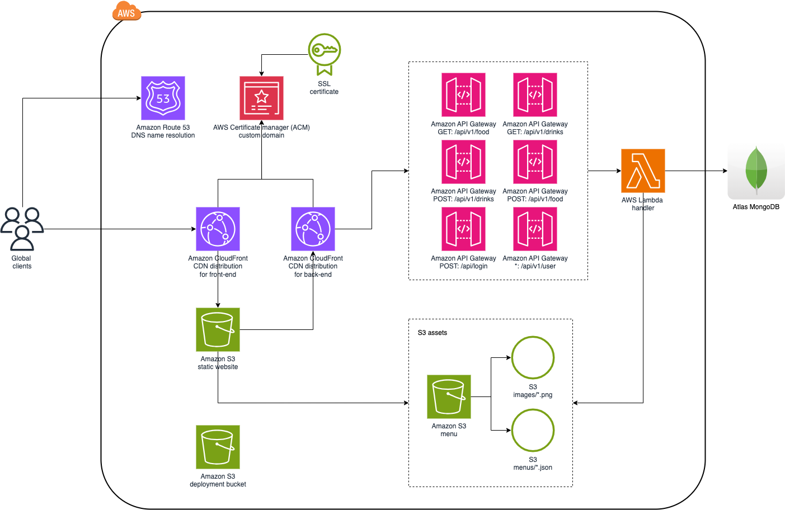

# Menu Browsing And Management System [](https://github.com/Sumysoul/server/actions/workflows/gradle.yml)

Serverless based back-end that set's up AWS infrastructure and serves restaurant menu content

## Architecture



## Prerequisites

- [Nodejs](https://nodejs.org/en/download)
- [serverless](https://www.serverless.com/) [Sdk](https://www.npmjs.com/package/serverless)
- [Jdk 21+](https://openjdk.org/projects/jdk/21/)
- [Gradle](https://gradle.org/)


## Setup

### Before script

- Create [AWS](https://aws.amazon.com) account
- Register domain (e.g. example.com)
- Request certificate (only in `us-east-1` region) with name `example.com` and setup 2 domains: `*.example.com`, `example.com`
- Add certificate CNAME to domain (during DNS validation)
- Create `.env` file with required environment variables:

```dotenv
#super user credentials
APP_INIT_USER_LOGIN='<super user login>'
APP_INIT_USER_PASSWORD='<super user password>'

#app
APP_NAME='<your application name>'
APP_STAGE='<your environment>'
APP_AUTH_JWT_SECRET='<secret that will be used to JWT token encryption and decryption>'
APP_AUTH_JWT_TTL='<JWT TTL>'

#db
APP_DB_URL='<Menu DB url>'
APP_DB_NAME='<Menu DB name>'

#aws
APP_AWS_REGION='<AWS region>'
APP_AWS_PROFILE='<AWS credentials profile>'

AWS_MENU_BUCKET='<Menu bucket name for assets>'
AWS_MENU_DRINKS_FILE='<Drinks file name>'
AWS_MENU_FOOD_FILE='<Food file name>'

#sls specific
AWS_SLS_ACM_CERTIFICATE_ARN='<Certificate created after domain registration>'
AWS_SLS_ACM_CERTIFICATE_NAME='<Certificate name, e.g example.com>'
AWS_SLS_HOSTED_ZONE_NAME='<Hosted Zone Name for registered domain>'
AWS_SLS_HOSTED_ZONE_ID='<Hosted Zone Id for website CDN>'
AWS_SLS_FRONTEND_DOMAIN_NAME='<Entrypoint DNS for website>'
AWS_SLS_BACK_END_DOMAIN_NAME='<Entrypoint DNS for backend>'
AWS_SLS_BACK_END_ARTIFACT_NAME='<Backend artifact name (including path, e.g. build/distributions/my-service-0.0.1-SNAPSHOT.zip))>'
```

### Run scrips

- Create DNS record set:
```shell
sls create_domain
```
- Build back-end artifact: 
```shell
./gradlew build
```
- Deploy artifact with infrastructure setup:
```shell
sls deploy --verbose
```
- In frontend application build static website: 
```shell
npm run build
```
- Copy `out/*` directory files to `client/dist` folder
- Upload static website content:
```shell
sls client deploy --no-confirm
```
- (optional) Update menu json if menus in assets/menus bucket are outdated:

```shell
curl --location 'api.example.com/api/login' \
--header 'Content-Type: application/json' \
--data '{
    "login": "",
    "password": ""
}'
```

```shell
curl --location 'api.example.com/api/v1/drinks' \
--header 'Content-Type: application/json' \
--header 'Authorization: Bearer <>token' \
--data '{
<prepared data>
}'
```

```shell
curl --location 'api.example.com/api/v1/food' \
--header 'Content-Type: application/json' \
--header 'Authorization: Bearer <>token' \
--data '{
<prepared data>
}'
```

- Check site connectivity

## Clean up

- Delete static website:
```shell
sls client remove --no-confirm
```
- Delete DNS record set for backend:
```shell
sls delete_domain
```
- Remove record set from AWS (2 record started from `api.`)
- Delete CloudFormation stack:
```shell
sls remove --verbose
```

## Development and Deployment

### Front-end

- Add changes to the code
- Build static website:
```shell
npm run build
```
- Copy `out/*` directory files to `client/dist` folder
- Upload static website content: 
```shell
sls client deploy --no-confirm
```
- Go to AWS CloudFront, invalidate cache for path `/*`

### Back-end

- Add changes to the code
- Build back-end artifact:
```shell
./gradlew build
```
- If configuration files were changed (e.g. [serverless](./serverless.yml),[functions](serverless/functions.yml),[CF template](serverless/template.yml)), run:
```shell
sls deploy --nos3sync --verbose
```
- If configuration files were not changed, run:
```shell
sls deploy -f main --verbose
```

## Local Development

- Add code changes
- Run:
```shell
./gradlew bootRun -Pargs="--spring.profiles.active=local"
```

## Additional Resources

- [serverless-api-gateway-domain](https://www.serverless.com/blog/serverless-api-gateway-domain)
- [Caching in with CloudFront using Serverless](https://medium.com/yld-blog/caching-in-with-cloudfront-using-serverless-5a174651ab14)
- [aws-node-single-page-app-via-cloudfront](https://github.com/serverless/examples/blob/master/aws-node-single-page-app-via-cloudfront/serverless.yml)
- Download assets from s3: `aws s3 sync s3://<bucket-name> ./assets/images --profile <profile>`
